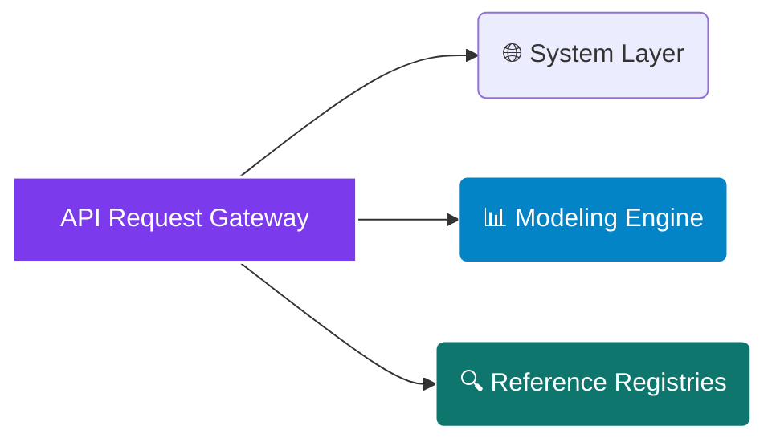

# <p align="center"></p>

<div align="center">

  <p><strong>The Only Research-Grade Building-Integrated Photovoltaics (BIPV) Energy Performance &amp; Asset Underwriting Engine Built for High-Vertical Urban Envelopes</strong></p>

</div>

<div align="center">

  <a href="https://rapidapi.com/bethelnedi/api/bipv-energy-yield-api"></a>
  <a href="https://elements.stoplight.io/viewer/?spec=https://raw.githubusercontent.com/bethelhash/BIPV-Energy-Yield-API/refs/heads/main/openapi.json"></a>
  
  
  

</div>

---

## ⚡ Executive Summary

The **BIPV Energy Yield API** is a deterministic computational engine purpose-built to model the specialized thermodynamic, geometric, and optical behaviors of building-integrated photovoltaics. Replaying complex conventional rooftop PV software models with an urban-centric approach, this engine isolates the performance profiles of vertical facade attachments, semi-transparent fenestration elements, and structural curtain walls.

By running an advanced multi-variable **HDKR anisotropic sky model** against multi-decadal meteorological databases and urban boundary envelope losses, the engine generates high-fidelity energy metrics, carbon mitigation trajectories, and asset underwriting schedules in **under 500ms**.

<blockquote align="left">

  <strong>💎 RESEARCH-GRADE COMPLIANCE DOCUMENTATION</strong><br>

  Developed by a structural engineering researcher specializing in sustainable envelopes, this engine eliminates analytical black-box risks. Every single parameter, temperature coefficient loop, and fiscal calculation maps directly back to a validated peer-reviewed publication or active international standard (IEC 61724-1, EN 50583-2), providing a defensible chain of custody for investor reports.

</blockquote>

---

## 🏛️ Enterprise Core Capabilities

<table width="100%">
  <tr>
    <td width="50%" valign="top">
      <h3>📈 Advanced Facade Underwriting</h3>
      <ul>
        <li><strong>Urban Loss Modeling:</strong> Accounts for multi-tier micro-climate parameters, including ventilated vs. non-ventilated facade air layers, architectural integration constraints, and partial urban shading profiles.</li>
        <li><strong>Lender Financial Matrices:</strong> Compiles complete asset lifecycle underwriting streams, outputting levelized cost of energy (LCOE), Net Present Value (NPV), and Internal Rate of Return (IRR) data sets.</li>
        <li><strong>ESG Carbon Decarbonization:</strong> Evaluates regional electrical grid baseline emissions profiles via IEA metrics to project lifetime carbon offset tonnages and exact physical carbon payback periods.</li>
      </ul>
    </td>
    <td width="50%" valign="top">
      <h3>🔌 Rigorous Boundary Physics</h3>
      <ul>
        <li><strong>Anisotropic Irradiance Stacking:</strong> Executes the HDKR transposition framework with Erbs diffuse fractions to accurately calculate complex sky-ground radiation bounces on vertical surfaces.</li>
        <li><strong>Sandia Cell Temperature Tracking:</strong> Resolves micro-level solar operating thermal dynamics using structural module boundary constants to compute active heat degradation.</li>
        <li><strong>IEC Performance Mapping:</strong> Evaluates total system operational efficiency, yielding standard-aligned Performance Ratio (PR) variables consistent with strict IEC 61724-1 guidelines.</li>
      </ul>
    </td>
  </tr>
</table>

---

## 🗺️ Market Architecture Hub

### 🌍 Global Meteorological Grids
The spatial resolution matrix references location-specific physical variables anywhere on Earth by accessing real multi-decadal climatological datasets:
`NASA POWER MERRA-2 Grid` &middot; `0.5° × 0.625° Resolution` &middot; `22-Year Climatological Average` &middot; `Global Timezone Layer`

### 📊 Structural Installation Categories
Thermal boundary coefficients and integration efficiency variables are mapped directly to localized civil engineering envelope conditions:
`Ventilated Facade Curtain Walls` &middot; `Non-Ventilated Insulated Facades` &middot; `Semi-Transparent BIPV Fenestration` &middot; `BIPV Roof Configurations`

---

## 📂 API Core Endpoint Directory



---

### 🌐 System Layer

* `GET /` — Exposes active API structural indices, build versions, and configuration frameworks.
* `GET /health` — Validates real-time system operational health, proxy connectivity, and logs the peer-reviewed methodology registry.
* `GET /pricing` — Returns active platform tier restrictions, execution rate limits, and product feature inclusions.

### 📊 Modeling Engine

* `GET /quick-estimate` — High-speed top-of-funnel scoping pathway. Requiring only latitude, area footprint, and generalized climate parameters to output peak power sizing, rough yield arrays, and baseline performance ratios. *(Free Tier)*
* `POST /calculate` — Institutional asset engineering pipeline. Ingests complex multi-tier coordinates, specific panel electrical properties, architectural mounting details, and local financial layers to build complete 25-year underwriting cash flows, monthly degradation maps, and environmental balance ledgers. *(Pro Tier)*

### 🔍 Reference Registries

* `GET /reference/states` — Returns regional base electricity metrics and utility reference parameters.
* `GET /reference/chemistry` — Exposes materials data structures for diverse cell configurations (e.g., Monocrystalline Si, BIPV Thin-Film).
* `GET /reference/methodology` — Streams the uncompressed verification ledger, full statutory references, and academic documentation maps behind the math core.

---

## 📈 Engineering Methodology & Verification Matrix

The engine completely avoids arbitrary point assumptions. Every operational block traces directly to historical scientific documentation to pass peer technical review panels:

| Calculation Block | Governing Model Framework | Primary Academic / Institutional Source Citation |
| --- | --- | --- |
| **Tilted Surface Irradiance** | Anisotropic HDKR Model | Reindl, Beckman & Duffie (1990) Solar Energy 45(5):299–305 |
| **Diffuse Sky Fraction** | Erbs Correlation Polynomial | Erbs, Klein & Duffie (1982) Solar Energy 28(4):309–317 |
| **Cell Temperature Metrics** | Sandia Performance Core | King et al. (2004) Sandia National Laboratories SAND2004-3535 |
| **Vertical Facade Validation** | Ross + Sandia Envelope Modifiers | Martín-Chivelet et al. (2022) Sustainability 14(3):1500 |
| **Architectural Loss Stacking** | IEA PVPS Task 15 Protocols | International Energy Agency BIPV Performance Guidelines Report (2018) |
| **System Yield & PR Logic** | Standard Monitoring Metrics | IEC 61724-1:2021 International Standard Edition |
| **Levelized Cost of Energy** | IRENA Financial Standard | International Renewable Energy Agency Generation Cost Database (2023) |
| **Long-Term Performance Decay** | Jordan & Kurtz Regression Core | Progress in Photovoltaics Research & Applications 21(1):12–29 (2013) |
| **Grid Emissions Intensity** | IEA Decarbonization Database | International Energy Agency Fuel Combustion Emissions Index (2023) |

---

## 🚀 Quickstart Integration Example (Python)

To programmatically post a complete high-fidelity facade installation analysis loop through the enterprise computing proxy, run the script below:

```python
import json
import requests

# Core Routing Configuration via RapidAPI Gateway
GATEWAY_URL = "[https://bipv-energy-yield-api.p.rapidapi.com/calculate](https://bipv-energy-yield-api.p.rapidapi.com/calculate)"

payload = {
    "location": {
        "latitude": 24.7,
        "longitude": 46.7,
        "altitude_m": 600,
        "climate_zone": "arid",
        "timezone_offset": 3
    },
    "panel": {
        "panel_type": "monocrystalline_si",
        "rated_power_wp": 400,
        "efficiency_stc": 0.20,
        "temp_coeff_pmax": -0.35,
        "noct": 45.0,
        "area_m2": 2.0,
        "is_semitransparent": False,
        "transparency": 0.0
    },
    "installation": {
        "installation_type": "ventilated_facade",
        "tilt_deg": 90,
        "azimuth_deg": 180,
        "total_area_m2": 500,
        "num_modules": 250,
        "inverter_efficiency": 0.96,
        "dc_cable_loss": 0.01,
        "ac_cable_loss": 0.005
    },
    "financial": {
        "electricity_price_usd_kwh": 0.10,
        "grid_region": "middle_east",
        "project_lifetime_years": 25,
        "discount_rate_pct": 7.0
    }
}

headers = {
    "Content-Type": "application/json",
    "X-API-Key": "YOUR_SECURE_MARKETPLACE_TOKEN",
    "X-RapidAPI-Host": "bipv-energy-yield-api.p.rapidapi.com"
}

response = requests.post(GATEWAY_URL, json=payload, headers=headers)
print(json.dumps(response.json(), indent=2))

```

---

## 💎 Production Access Tiers

| Tier Classification | Monthly Access Fees | Active Rate Latency Caps | Inclusive Data Volume Quota | Programmatic Endpoint Access | Support Service Level |
| --- | --- | --- | --- | --- | --- |
| **Free Tier Core** | $0 / Month | 5 Requests / Minute | 10 Calls / Month | `/quick-estimate` + Basic Reference | Open Community Forum |
| **Pro Enterprise** | $49 / Month | 1,000 Requests / Hour | Unlimited | Full `/calculate` Suite + NASA Core | Standard Service SLA |
| **Ultra Institutional** | $199 / Month | 1,000 Requests / Hour | Unlimited | Full Access + Full White-Label Rights | Dedicated Operations SLA |

* **Platform Tool Access & Sandboxes:** Pro and Ultra tiers unlock direct key validation on the [BIPV Facade Design Tool (bipv-facade-tool.vercel.app)](https://www.google.com/search?q=https://bipv-facade-tool.vercel.app/). Entering an active Pro token generates complete, uncompressed engineering reports with comprehensive financial schedules.
* **White-Label Integration Deployment:** Ultra tier subscribers gain structural rights to remove native branding metrics and frame the interactive design framework directly on corporate engineering domains or manufacturer client web spaces (subject to a 1-day deployment domain validation).

---

## 🔒 Proprietary License & Terms

### Intellectual Property Protection

**Copyright © 2026 Axiom Infrastructure Intelligence LLP. All rights reserved.**

The BIPV Energy Yield API, its underlying vertical thermal transposition calculation modules, anisotropic mathematical matrix blocks, interface parameter mappings, and compiled reference datasets are the exclusive proprietary intellectual property of Axiom Infrastructure Intelligence LLP. No part of this endpoint design schema, calculation hierarchy, or code infrastructure may be replicated, reverse-engineered, white-labeled, or redistributed without an active Master Services Agreement (MSA) and express written licensing permission from the corporate rights holder.

### Technical Disclaimer

All energy simulation arrays, emissions assessments, and levelized financial forecasts generated by this core model serve as high-fidelity scoping screens for early design-phase evaluations. Project planners must engage a licensed professional structural engineer bound to local building codes, a certified envelope designer, and an accredited financial auditor before finalizing panel procurement or commencing on-site structural works.

```

```
